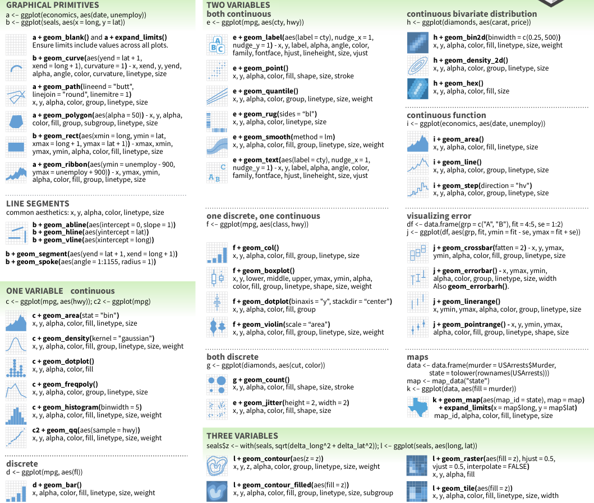

```{r, echo = FALSE}
# https://stackoverflow.com/questions/25646333/code-chunk-font-size-in-rmarkdown-with-knitr-and-latex
def.chunk.hook  <- knitr::knit_hooks$get("chunk")
knitr::knit_hooks$set(chunk = function(x, options) {
  x <- def.chunk.hook(x, options)
  ifelse(options$size != "normalsize", paste0("\\", options$size,"\n\n", x, "\n\n \\normalsize"), x)
})
knitr::opts_chunk$set(
  echo = TRUE, eval = TRUE, cache = FALSE, results = FALSE, warning = FALSE, message = FALSE,
  fig.align = "center", out.width = "60%", fig.dim = c(7, 5)
)
```

## TOC

- The working environment
- Loading data into tibbles
- Plotting data in tibbles
- Conditional queries on tibbles
- Transforming and manipulating tibbles
- Combining tibbles with join operations

# The working environment

## R, RStudio and the tidyverse

- R is a fully featured programming language, but it excels as an environment for (statistical) data analysis (https://www.r-project.org)

- RStudio is an integrated development environment (IDE) for R (and other languages): (https://www.rstudio.com/products/rstudio)

- The tidyverse is a collection of packages with well-designed and consistent interfaces for the main steps of data analysis: loading, transforming and plotting data (https://www.tidyverse.org)
  - This introduction works with: `readr`, `tibble`, `ggplot2`, `dplyr` and `tidyr`

# Loading data into tibbles

## Reading data with readr

```{r echo = FALSE}
sample_table_url <- "https://raw.githubusercontent.com/SPAAM-community/AncientMetagenomeDir/b187df6ebd23dfeb42935fd5020cb615ead3f164/ancientmetagenome-hostassociated/samples/ancientmetagenome-hostassociated_samples.tsv"
library_table_url <- "https://raw.githubusercontent.com/SPAAM-community/AncientMetagenomeDir/b187df6ebd23dfeb42935fd5020cb615ead3f164/ancientmetagenome-hostassociated/libraries/ancientmetagenome-hostassociated_libraries.tsv"
```

- With R we usually operate on data in our computer's memory
- The tidyverse provides the package `readr` to read data from text files into the memory
- `readr` can read from our file system or the internet
- It provides functions to read data in almost any (text) format:

```{r eval=FALSE}
readr::read_csv()   # .csv files
readr::read_tsv()   # .tsv files
readr::read_delim() # tabular files with an arbitrary separator
readr::read_fwf()   # fixed width files
readr::read_lines() # read linewise to parse yourself 
```

- `readr` automatically detects column types - or your define them manually

## How does the interface of `read_csv` work?

- We can learn more about a function with the `?` to open its help file: `?readr::read_csv`
- `readr::read_csv` has many options to specify how to read a text file

```{r eval=FALSE}
read_csv(
  file,                      # The path to the file we want to read
  col_names = TRUE,          # Are there column names?
  col_types = NULL,          # Which types do the columns have? NULL -> auto
  locale = default_locale(), # How is information encoded in this file?
  na = c("", "NA"),          # Which values mean "no data"
  trim_ws = TRUE,            # Should superfluous white-spaces be removed?
  skip = 0,                  # Skip X lines at the beginning of the file
  n_max = Inf,               # Only read X lines
  skip_empty_rows = TRUE,    # Should empty lines be ignored? 
  comment = "",              # Should comment lines be ignored?
  name_repair = "unique",    # How should "broken" column names be fixed
  ...
)
```

## What does `readr` produce? The tibble!

```{r}
samples <- readr::read_tsv(sample_table_url)
```

- The `tibble` is a "data frame", a tabular data structure with rows and columns
- Unlike a simple array, each column can have another data type

```{r results='markup'}
print(samples, n = 3)
```

## How to look at a tibble?

```{r, eval=FALSE}
samples          # Typing the name of an object will print it to the console
str(samples)     # A structural overview of an object
summary(samples) # A human-readable summary of an object
View(samples)    # RStudio's interactive data browser
```

- R provides a very flexible indexing operation

```{r, eval=FALSE}
samples[1,1]                         # Access the first row and column
samples[1,]                          # Access the first row
samples[,1]                          # Access the first column
samples[c(1,2,3),c(2,3,4)]           # Access a selection of rows and columns
samples[,-c(1,2)]                    # Remove the first two columns
samples[,c("site_name", "material")] # Columns can be selected by name
```

- tibbles are mutable data structures, so their content can be overwritten

```{r, eval=FALSE}
samples[1,1] <- "Cheesecake2015"     # replace the first value in the first column 
```

# Plotting data in tibbles

## ggplot2 and the "grammar of graphics"

- `ggplot2` offers an unusual, but powerful and logical interface
- The following example describes a stacked bar chart

```{r}
library(ggplot2)
```

```{r eval=FALSE}
ggplot(          # Every plot starts with a call to the ggplot() function
  data = samples # This function can also take the input tibble
) +              # The plot consists of functions linked with +
geom_bar(        # "geoms" define the plot layers we want to draw
  mapping = aes( # The aes() function maps variables to visual properties
    x = publication_year, # publication_year -> x-axis
    fill = community_type # publication_year -> fill color
  )
)
```

- `geom_*`: data + geometry + statistical transformation + repositioning

## ggplot2 and the "grammar of graphics"

```{r}
ggplot(samples) +
geom_bar(aes(x = publication_year, fill = community_type))
```

## ggplot2 features many geoms

\centering
{width=64%}

## Scales

```{r}
ggplot(samples) +
geom_jitter(aes(x = publication_year, y = sample_age))
```

## Scales

```{r}
ggplot(samples) +
geom_jitter(aes(x = publication_year, y = sample_age)) +
scale_y_log10()
```

## Scales

```{r}
ggplot(samples) +
geom_jitter(aes(x = publication_year, y = sample_age, color = material)) +
scale_y_log10()
```

## Scales

```{r}
ggplot(samples) +
geom_jitter(aes(x = publication_year, y = sample_age, color = material)) +
scale_y_log10() + scale_color_manual(values = c("dental calculus" = "red"))
```

## Coords

## Plot matrizes

facet_wrap
facet_grid

## Exercise 1

# Conditional queries on tibbles

## Filter rows and select columns

dplyr::filter
dplyr::select

## The pipe

## Summary statistics

nrow
length
unique
mean
median
var

## Group-wise summaries

dplyr::group_by
dplyr::summarise
dplyr::n()

## Sorting tibbles

dplyr::arrange()

## Exercise 2

# Transforming and manipulating tibbles

## Renaming columns

dplyr::rename

## Adding columns to tibbles

dplyr::mutate
dplyr::transmute
tibble::add_column

## Conditional operations

dplyr::case_when

## Splitting and unifying columns

tidyr::separate
tidyr::unite

## Long and wide data formats

tidyr::pivot_wider
tidyr::pivot_longer

## Exercise 3

# Combining tibbles with join operations

## Types of joins

## Left join

dplyr::left_join

## Right join

dplyr::right_join

## Inner join

dplyr::inner_join

## Full join

dplyr::full_join

## Semi join

dplyr::semi_join

## Anti join

dplyr::anti_join

## Exercise 4
